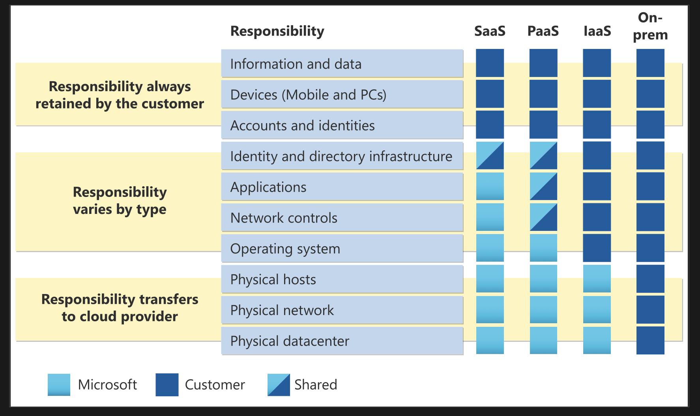

# Describe the shared responsibility model?

## Ans:

- The shared responsibility model explains how responsibilities are divided between the cloud provider and the customer. In a traditional on-premises setup, the company is responsible for everything, including physical security, hardware maintenance, infrastructure, software, and access control. In the cloud, responsibilities are shared.

- The cloud provider handles physical security, power, cooling, networking, and hardware maintenance, while the customer is responsible for securing their data, managing access, and configuring services properly. Depending on the cloud service model, the level of responsibility varies. With IaaS, the customer handles most of the stack, including the OS, apps, and data, while the provider manages the physical infrastructure. With PaaS, responsibilities are shared the provider manages the platform, and the customer manages the apps and data. With SaaS, the provider handles almost everything, and the customer is mainly responsible for data and user access.

- For example, if using Azure SQL Database (PaaS), Azure manages the database engine, but the customer is responsible for the data. If running SQL on a virtual machine (IaaS), the customer is responsible for OS patches, database management, and the data itself. The shared responsibility model ensures clarity about who handles what in cloud environments.

## When using a cloud provider, you’ll always be responsible for:

 - The information and data stored in the cloud
 - Devices that are allowed to connect to your cloud
 - Accounts and identities of the people, services, and devices within your organization

 ## The cloud provider is always responsible for:

 - The physical datacenter
 - The physical network
 - The physical hosts

 ## Your service model will determine responsibility for things like:
 - Operating systems
 - Network controls
 - Applications
 - Identify and infrastructure
 
