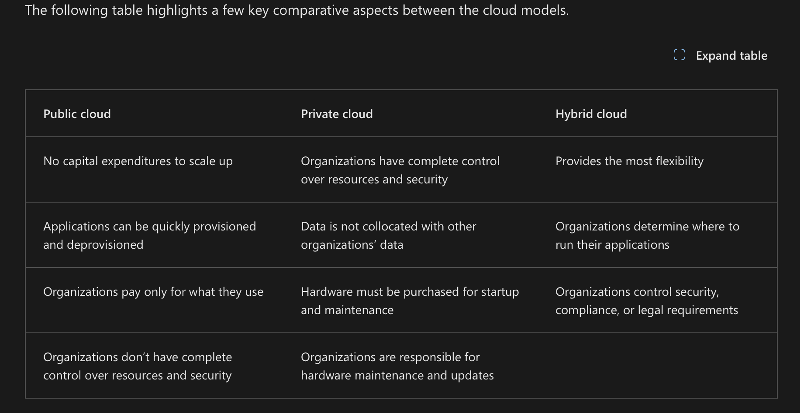

# Define cloud modles?

- Ans: The cloud models define the deployment type of cloud resources. The three main cloud models are: private, public, and hybrid.

## Private Cloud

- Let’s start with a private cloud. A private cloud is, in some ways, the natural evolution from a corporate datacenter. It’s a cloud (delivering IT services over the internet) that’s used by a single entity. Private cloud provides much greater control for the company and its IT department. However, it also comes with greater cost and fewer of the benefits of a public cloud deployment. Finally, a private cloud may be hosted from your on site datacenter. It may also be hosted in a dedicated datacenter offsite, potentially even by a third party that has dedicated that datacenter to your company.

## Public Cloud

- A public cloud is built, controlled, and maintained by a third-party cloud provider. With a public cloud, anyone that wants to purchase cloud services can access and use resources. The general public availability is a key difference between public and private clouds.

## Hybrid Cloud

- A hybrid cloud is a computing environment that uses both public and private clouds in an inter-connected environment. A hybrid cloud environment can be used to allow a private cloud to surge for increased, temporary demand by deploying public cloud resources. Hybrid cloud can be used to provide an extra layer of security. For example, users can flexibly choose which services to keep in public cloud and which to deploy to their private cloud infrastructure.

## Multi-Cloud

- A fourth, and increasingly likely scenario is a multi-cloud scenario. In a multi-cloud scenario, you use multiple public cloud providers. Maybe you use different features from different cloud providers. Or maybe you started your cloud journey with one provider and are in the process of migrating to a different provider. Regardless, in a multi-cloud environment you deal with two (or more) public cloud providers and manage resources and security in both environments.

## Azure Arc

- Azure Arc is a set of technologies that helps manage your cloud environment. Azure Arc can help manage your cloud environment, whether it's a public cloud solely on Azure, a private cloud in your datacenter, a hybrid configuration, or even a multi-cloud environment running on multiple cloud providers at once.

## Azure VMware Solution

- What if you’re already established with VMware in a private cloud environment but want to migrate to a public or hybrid cloud? Azure VMware Solution lets you run your VMware workloads in Azure with seamless integration and scalability.

